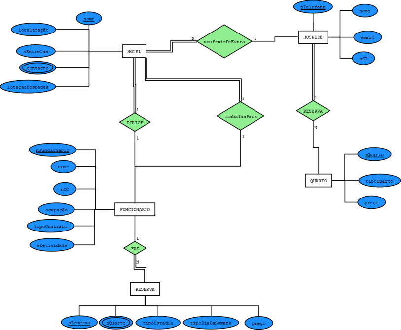

# C3 : Esquema conceptual

## Modelo E/A

### Entidades Tipo:

- HOTEL(<ins>nome</ins>, localização, nEstrelas, contacto, lotacaoHospedes)

Um hotel normalmente possui um nome, um local onde está localizado, o número de estrelas que determina a qualidade do hotel, um contacto e uma lotação máxima de hóspedes tendo em conta o tamanho do mesmo.

- HOSPEDE(nome, <ins>nTelefone</ins>, nCC, email)

Um hóspede possui sempre um nome, várias maneiras de contactá-lo como um número de telefone e e-mail e também possui um documento que o identifica tal como o cartão do cidadão.

- QUARTO(<ins>nQuarto</ins>, tipoQuarto, preço)

Um quarto de hotel dispõe de um preço, de um tipo de quarto, ou seja, se é single, casal, familiar ou suite, um preço dependendo do tipo e um número associado a ele.

- FUNCIONARIO(<ins>nFuncionario</ins>, nome, nCC, ocupação, tipoContrato, efetividade)

Um funcionário de hotel possui um nome, um número de identificação (cartão do cidadão), uma ocupação, ou seja, se é chefe, cozinheiro, limpezas, etc. O funcionário também tem um tipo de contrato (efetivo ou temporário) e uma efetividade.

- RESERVA(<ins>nReserva</ins>, nQuarto, tipoEstadia, tipoDiaDaSemana, preço)

Uma reserva num hotél implica reservar um quarto e escolher o tipo de estadia que deseja, que vai dar a um determinado preço.

### Associações:

- RESERVA(HOSPEDE, QUARTO) 1:N total/parcial

Um hóspede pode reservar um quarto antes de chegar ao hotel.

- trabalhaPara(FUNCIONARIO, HOTEL) 1:1 parcial/total

Um funcionário trabalha para um hotel. 

- DIRIGE(FUNCIONARIO, HOTEL) 1:1 parcial/total

Um funcionário cuja a sua ocupação seja gestor dirige o hotel a que está associado.

- FAZ(FUNCIONARIO, RESERVA) 1:N parcial/total

Um funcionário insere no sistema a reserva que o hóspede necessita.

- usufruirDeExtra(HOSPEDE, HOTEL) 1:N parcial/total

Um hóspede pode usufruir de uma ou várias atividades extra como spa, banho turco, piscina, etc.

### Modelo Entidade-Associação:

  
   

## Regras de negócio adicionais (Restrições)

- Cada funcionário está dirigido apenas a uma atividade.

- Cada funcionário está ligado a um único andar.

- Cada cliente só pode optar por um tipo de pensão por cada reserva.

- Se o cliente pretender as refeições no quarto, tem que avisar a receção com 24h de antecedência.

- O cliente só pode cancelar a reserva até 48h do dia da reserva.

- O cliente não pode alterar a reserva no dia do check in.

---
[< Previous](rei02.md) | [^ Main](https://github.com/SIBD02/TrabalhoFinal/) | Next >
:--- | :---: | ---: 
